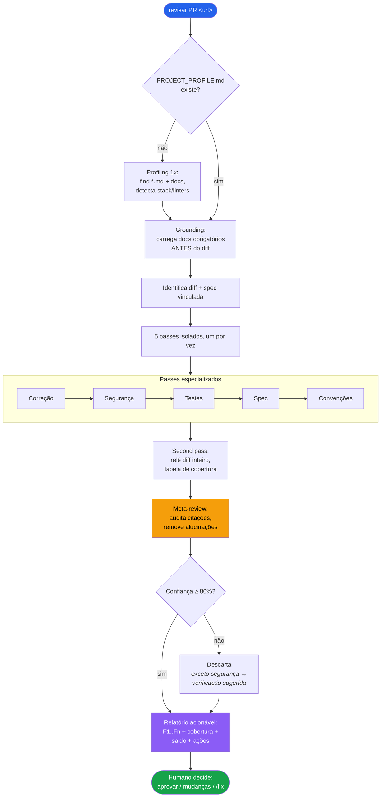
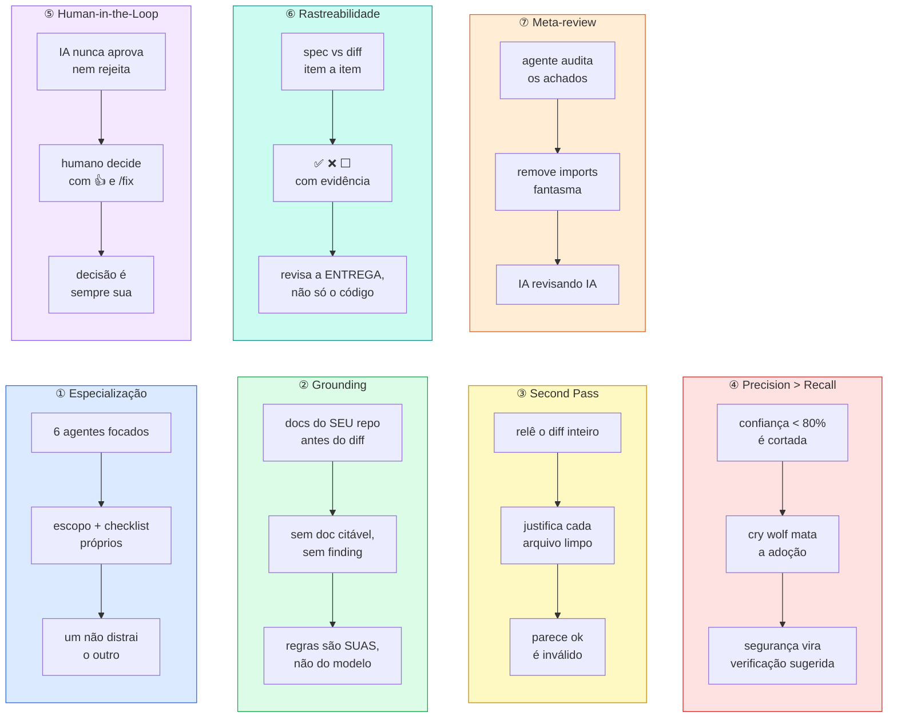

# pr-review-skill

[Português](README.md) · **English** · [Español](README.es.md)

AI-assisted PR reviews **trustworthy enough to act on** — without the false-positive noise that destroys trust in the tool.

A canonical skill versioned in your repo. Works with **any agentic coding tool**: the skill is plain markdown, tool-agnostic. It ships with native pointer-adapters for **Claude Code**, **Cursor** and **GitHub Copilot** — any other agent (Windsurf, Zed, Aider, Continue, …) just needs to point at `SKILL.md`. Based on the *7 Pillars of Trustworthy AI Review* framework.

## Installation

```bash
npx pr-review-skill init
```

Detects the tools present (`.claude/`, `.cursor/`, `.github/`), installs the canonical skill into `.claude/skills/pr-review/` (configurable with `--dir`) and generates pointer-adapters for each detected tool. Idempotent — running it twice never overwrites anything without `--force`. Use `--yes` in CI/scripts.

> **Any agent.** The automatic adapters cover Claude Code, Cursor and Copilot. For any other agentic tool, just instruct it to read and follow `.claude/skills/pr-review/SKILL.md` (or the path you set with `--dir`) — the skill content does not depend on any specific tool.

Then commit the installed folder. The `git log` of the canonical directory becomes the history of your team's review rules.

## How to use

With the skill installed, ask for a review by passing the **PR URL**:

```
revisar PR https://github.com/org/repo/pull/123
review this PR https://github.com/org/repo/pull/123
revisar este PR https://github.com/org/repo/pull/123
review the diff https://github.com/org/repo/pull/123
```

**On the project's first review**, the skill automatically detects the stack, linters and docs of your repository and generates a `PROJECT_PROFILE.md` — you only need to answer what it cannot infer on its own. From the second review on, the profile is ready and the review starts right away.

The output is always an **actionable report** with numbered findings (F1, F2 …), a file-by-file coverage table, traceability against the ticket/spec and an audit balance. The AI never approves or rejects — the final decision is always yours.

## Commands

| Command | What it does |
|---|---|
| `npx pr-review-skill init` | Installs the canonical skill + adapters |
| `npx pr-review-skill@latest update` | Updates the skill; **never** touches your `PROJECT_PROFILE.md` or the adapters |
| `npx pr-review-skill doctor` | Diagnoses the install: what exists, what's missing, the next step |

### Flags

| Flag | Description |
|---|---|
| `--dir <path>` | Canonical skill directory (default: `.claude/skills/pr-review`) |
| `--force` | Overwrites existing files on `init` (includes the language config) |
| `--yes` | Skips the interactive confirmation (useful in CI) |
| `--lang <code>` | Report language (`init`): `pt-BR`, `en` or `es`. Default `pt-BR` |
| `--help`, `-h` | Shows help |

## Review language (i18n)

The review report is emitted in the language chosen for the project. The choice is
made **once, at install time**, and stays versioned alongside the repo.

- In interactive `init`, the CLI asks for the language (1 = `pt-BR`, 2 = `English`, 3 = `Español`).
- In CI/scripts use the flag: `npx pr-review-skill init --yes --lang en`.
- With no flag and no interactive terminal, the default is `pt-BR`.

The choice is written to `.claude/skills/pr-review/pr-review.config.json`:

```json
{ "lang": "pt-BR" }
```

This file is yours: `update` **never** overwrites it (same as `PROJECT_PROFILE.md`).
To change the language later, edit the JSON by hand or run `init` again with
`--lang <code>` (or `--force`). `doctor` shows the configured language.

Only the **user-facing output** is translated — the skill's internal files stay
in pt-BR; code snippets, file names and commands are not translated.

## How it works



The review follows a 7-step pipeline, each step run by an isolated agent:

### 1. Grounding (before the diff)

Reads `PROJECT_PROFILE.md` and loads every doc marked `obrigatório` (required) **before** looking at a single line of the diff. Convention and architecture findings can only cite those docs — no doc, no finding. Docs marked `sob demanda` (on-demand) declare a **Scope** (paths/globs) in the profile and are loaded automatically when the diff touches that scope — becoming citable for the files they cover.

### 2. Diff and spec identification

Fetches the full PR diff and looks for the linked ticket or spec (PR link, ID in the branch/title). If there's a spec, the traceability pass runs; if not, it's marked "not verifiable".

### 3. Five specialized passes (one at a time)

Each pass runs isolated, with its own scope and checklist:

| Pass | Focus |
|---|---|
| **Correctness** | Bugs, incorrect logic, runtime errors |
| **Security** | OWASP, injection, data exposure, authentication |
| **Tests** | Coverage, missing cases, fragile tests |
| **Spec** | Diff matches the ticket requirements, item by item (✅/❌/⬜), scope creep |
| **Conventions** | Project standards per the docs; configured linters produce no comment |

Each pass receives: the diff, the detected stack, the list of linters to suppress and the required docs. One pass never contaminates another.

### 4. Second pass — full coverage

Re-reads the whole diff and builds a table with **all** changed files. Every "clean" file needs a specific justification — `"looks ok"` is invalid. Lockfiles and generated files are explicitly marked "generated — not reviewed".

### 5. Meta-review (anti-hallucination)

An agent audits the other agents' findings before delivery:

- Re-check of every `file:line` citation against the real diff
- Removal of phantom imports, invented signatures and dead code without evidence
- Emits a mandatory balance: `"N audited, M removed (reasons), P downgraded to question"`

### 6. Confidence filter ≥ 80%

Findings with confidence below 80% are discarded. **Deliberate exception:** security findings with confidence < 80% don't vanish — they become a "suggested verification" with the exact question to answer. A security false negative has an asymmetric cost.

### 7. Report

Built from a structured template with: findings with stable IDs + **generating pillar** + confidence + evidence + **comment anchor** (`file:line` + diff side) + **suggested comment** ready to paste into the PR + doc citation; coverage table; spec traceability; audit balance; a **7-pillar coverage** checklist (attests every stage ran); and a block of actions for the human (approve / request changes / `/detalhar F1` / `/fix F1 F3`). The anchor tells you exactly **where** to post each comment — the AI delivers it, you post it.

## The 7 Pillars



| # | Pillar | What it guarantees |
|---|---|---|
| ① | **Specialization** | 6 focused agents (5 passes + meta-review), each with its own scope and checklist — one doesn't distract the other |
| ② | **Grounding** | YOUR repo's docs are loaded before the diff; a convention finding without a citable doc is not emitted |
| ③ | **Second Pass** | re-reads the whole diff and justifies, file by file, why what's clean is clean |
| ④ | **Precision > Recall** | findings with confidence < 80% are cut; crying wolf kills adoption (exception: security becomes a suggested verification) |
| ⑤ | **Human-in-the-Loop** | the AI never approves or rejects; the report ends by offering the actions to you |
| ⑥ | **Traceability** | diff verified against the ticket/spec criteria, item by item (✅/❌/⬜), including scope creep |
| ⑦ | **Meta-review** | an agent audits the others' findings: nonexistent lines, invented APIs and unsourced rules are removed |

## Installed structure

```
.claude/skills/pr-review/        # canonical skill (single source of truth)
├── SKILL.md                     # review orchestration
├── passes/                      # 5 specialized passes + meta-review
│   ├── correcao.md
│   ├── seguranca.md
│   ├── testes.md
│   ├── spec.md
│   ├── convencoes.md
│   └── meta-review.md
├── checklists/                  # per-language pitfalls
│   ├── go.md
│   ├── java.md
│   ├── javascript.md
│   ├── kotlin.md
│   ├── python.md
│   └── ruby.md
├── templates/                   # report and PROJECT_PROFILE
│   ├── relatorio.template.md
│   └── PROJECT_PROFILE.template.md
├── profiling.md                 # automatic project parameterization
├── pr-review.config.json        # review language — yours, never overwritten
└── PROJECT_PROFILE.md           # generated on the 1st review — yours, never overwritten

.cursor/rules/pr-review.mdc                       # pointer → canonical skill
.github/instructions/pr-review.instructions.md    # pointer → canonical skill
```

`PROJECT_PROFILE.md` records the stack, configured linters and project docs. `update` **never** overwrites it — it's yours.

## Supported languages

Go · Java · JavaScript/TypeScript · Kotlin · Python · Ruby

Each programming language has its own checklist of common pitfalls, loaded automatically from the stack detected in `PROJECT_PROFILE.md`.

## Requirements

- Node ≥ 18 (only to install/update — the review runs in your AI tool)

## License

MIT
