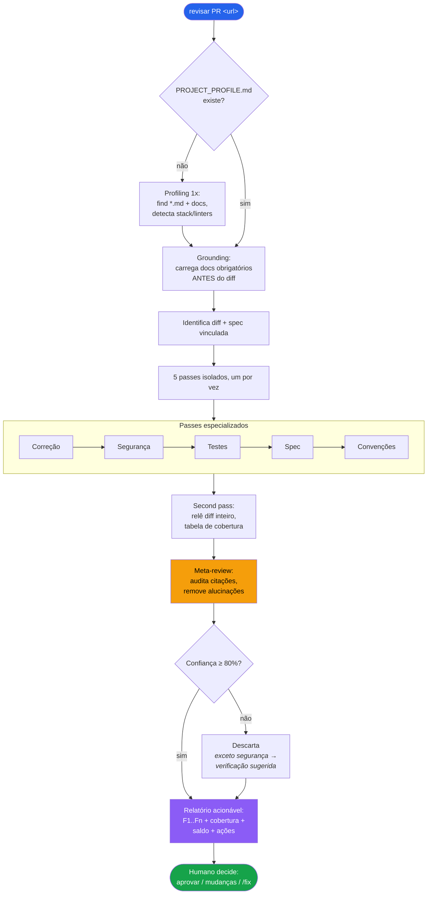
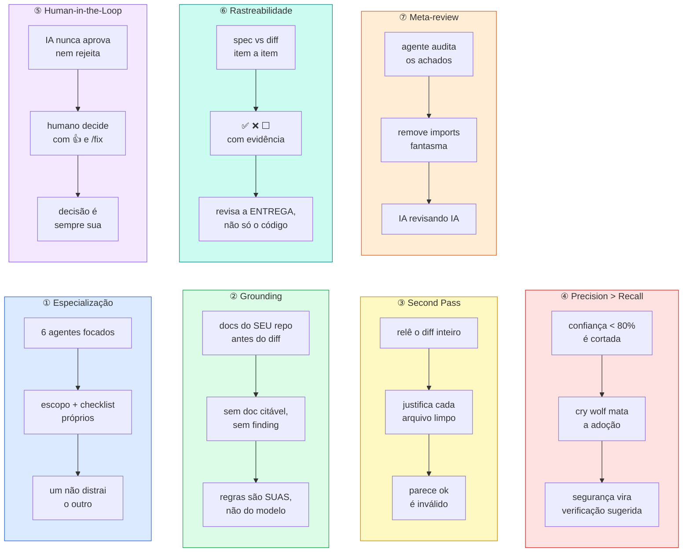

# pr-review-skill

[Português](README.md) · [English](README.en.md) · **Español**

Revisiones de PR asistidas por IA **lo bastante fiables como para actuar sobre ellas** — sin el ruido de falsos positivos que destruye la confianza en la herramienta.

Una skill canónica versionada en tu repo. Funciona con **cualquier herramienta agéntica** de código: la skill es markdown puro, agnóstica de herramienta. Incluye adaptadores-puntero nativos para **Claude Code**, **Cursor** y **GitHub Copilot** — cualquier otro agente (Windsurf, Zed, Aider, Continue, …) solo necesita apuntar a `SKILL.md`. Basada en el framework *Los 7 Pilares de la Revisión Fiable con IA*.

## Instalación

```bash
npx pr-review-skill init
```

Detecta las herramientas presentes (`.claude/`, `.cursor/`, `.github/`), instala la skill canónica en `.claude/skills/pr-review/` (configurable con `--dir`) y genera adaptadores-puntero para cada herramienta detectada. Idempotente — ejecutarlo dos veces nunca sobrescribe nada sin `--force`. Usa `--yes` en CI/scripts.

> **Cualquier agente.** Los adaptadores automáticos cubren Claude Code, Cursor y Copilot. Para cualquier otra herramienta agéntica, basta con indicarle que lea y siga `.claude/skills/pr-review/SKILL.md` (o la ruta que definas con `--dir`) — el contenido de la skill no depende de ninguna herramienta específica.

Después haz commit de la carpeta instalada. El `git log` del directorio canónico se convierte en el historial de las reglas de revisión de tu equipo.

## Cómo usar

Con la skill instalada, pide una revisión pasando la **URL del PR**:

```
revisar PR https://github.com/org/repo/pull/123
review this PR https://github.com/org/repo/pull/123
revisar este PR https://github.com/org/repo/pull/123
review the diff https://github.com/org/repo/pull/123
```

**En la primera revisión del proyecto**, la skill detecta automáticamente el stack, los linters y los docs de tu repositorio y genera un `PROJECT_PROFILE.md` — solo necesitas responder lo que no pueda inferir por sí sola. A partir de la segunda revisión, el profile ya está listo y la revisión empieza directamente.

El resultado es siempre un **informe accionable** con findings numerados (F1, F2 …), tabla de cobertura archivo por archivo, trazabilidad contra el ticket/spec y balance de auditoría. La IA nunca aprueba ni rechaza — la decisión final es siempre tuya.

## Comandos

| Comando | Qué hace |
|---|---|
| `npx pr-review-skill init` | Instala la skill canónica + adaptadores |
| `npx pr-review-skill@latest update` | Actualiza la skill; **nunca** toca tu `PROJECT_PROFILE.md` ni los adaptadores |
| `npx pr-review-skill doctor` | Diagnostica la instalación: qué existe, qué falta, el siguiente paso |

### Flags

| Flag | Descripción |
|---|---|
| `--dir <path>` | Directorio canónico de la skill (default: `.claude/skills/pr-review`) |
| `--force` | Sobrescribe archivos existentes en `init` (incluye el config de idioma) |
| `--yes` | Omite la confirmación interactiva (útil en CI) |
| `--lang <code>` | Idioma del informe (`init`): `pt-BR`, `en` o `es`. Default `pt-BR` |
| `--help`, `-h` | Muestra la ayuda |

## Idioma de la revisión (i18n)

El informe de revisión se emite en el idioma elegido para el proyecto. La elección se
hace **una vez, en la instalación**, y queda versionada junto al repo.

- En el `init` interactivo, la CLI pregunta el idioma (1 = `pt-BR`, 2 = `English`, 3 = `Español`).
- En CI/scripts usa la flag: `npx pr-review-skill init --yes --lang en`.
- Sin flag y sin terminal interactiva, el default es `pt-BR`.

La elección se escribe en `.claude/skills/pr-review/pr-review.config.json`:

```json
{ "lang": "pt-BR" }
```

Ese archivo es tuyo: `update` **nunca** lo sobrescribe (igual que `PROJECT_PROFILE.md`).
Para cambiar el idioma después, edita el JSON a mano o ejecuta `init` de nuevo con
`--lang <code>` (o `--force`). `doctor` muestra el idioma configurado.

Solo la **salida al usuario** se traduce — los archivos internos de la skill siguen
en pt-BR; los fragmentos de código, nombres de archivo y comandos no se traducen.

## Cómo funciona



La revisión sigue un pipeline de 7 etapas, cada una ejecutada por un agente aislado:

### 1. Grounding (antes del diff)

Lee el `PROJECT_PROFILE.md` y carga todos los docs marcados como `obrigatório` (obligatorio) **antes** de mirar una sola línea del diff. Los findings de convención y arquitectura solo pueden citar esos docs — sin doc, sin finding. Los docs marcados `sob demanda` (bajo demanda) declaran un **Alcance** (paths/globs) en el profile y se cargan automáticamente cuando el diff toca ese alcance — volviéndose citables para los archivos que cubren.

### 2. Identificación del diff y la spec

Obtiene el diff completo del PR y busca el ticket o spec vinculado (enlace en el PR, ID en la branch/título). Si hay spec, el pase de trazabilidad se ejecuta; si no, se marca como "no verificable".

### 3. Cinco pases especializados (uno a la vez)

Cada pase se ejecuta aislado, con su propio scope y checklist:

| Pase | Foco |
|---|---|
| **Corrección** | Bugs, lógica incorrecta, errores de runtime |
| **Seguridad** | OWASP, inyección, exposición de datos, autenticación |
| **Tests** | Cobertura, casos faltantes, tests frágiles |
| **Spec** | El diff coincide con los requisitos del ticket, ítem por ítem (✅/❌/⬜), scope creep |
| **Convenciones** | Estándares del proyecto según los docs; los linters configurados no generan comentario |

Cada pase recibe: el diff, el stack detectado, la lista de linters a suprimir y los docs obligatorios. Un pase nunca contamina a otro.

### 4. Second pass — cobertura completa

Relee el diff entero y arma una tabla con **todos** los archivos modificados. Todo archivo "limpio" necesita una justificación específica — `"parece ok"` es inválido. Los lockfiles y archivos generados se marcan explícitamente como "generado — no revisado".

### 5. Meta-review (anti-alucinación)

Un agente audita los findings de los demás antes de entregar:

- Reverificación de cada cita `archivo:línea` contra el diff real
- Eliminación de imports fantasma, firmas inventadas y dead code sin evidencia
- Emite un balance obligatorio: `"N auditados, M eliminados (motivos), P degradados a pregunta"`

### 6. Filtro de confianza ≥ 80%

Los findings con confianza por debajo del 80% se descartan. **Excepción deliberada:** los findings de seguridad con confianza < 80% no desaparecen — se convierten en "verificación sugerida" con la pregunta exacta a responder. Un falso negativo de seguridad tiene un costo asimétrico.

### 7. Informe

Construido a partir de una plantilla estructurada con: findings con IDs estables + **pilar generador** + confianza + evidencia + **ancla de comentario** (`archivo:línea` + lado del diff) + **comentario sugerido** listo para pegar en el PR + cita de doc; tabla de cobertura; trazabilidad de la spec; balance de auditoría; una checklist de **cobertura de los 7 pilares** (certifica que cada etapa corrió); y un bloque de acciones para el humano (aprobar / pedir cambios / `/detalhar F1` / `/fix F1 F3`). El ancla dice exactamente **dónde** publicar cada comentario — la IA lo entrega, tú lo publicas.

## Los 7 Pilares



| # | Pilar | Qué garantiza |
|---|---|---|
| ① | **Especialización** | 6 agentes enfocados (5 pases + meta-review), cada uno con su propio scope y checklist — uno no distrae al otro |
| ② | **Grounding** | los docs de TU repo se cargan antes del diff; un finding de convención sin doc citable no se emite |
| ③ | **Second Pass** | relee el diff entero y justifica, archivo por archivo, por qué lo que quedó limpio está limpio |
| ④ | **Precision > Recall** | los findings con confianza < 80% se cortan; gritar "lobo" mata la adopción (excepción: seguridad pasa a verificación sugerida) |
| ⑤ | **Human-in-the-Loop** | la IA nunca aprueba ni rechaza; el informe termina ofreciéndote las acciones |
| ⑥ | **Trazabilidad** | diff verificado contra los criterios del ticket/spec, ítem por ítem (✅/❌/⬜), incluyendo scope creep |
| ⑦ | **Meta-review** | un agente audita los hallazgos de los demás: líneas inexistentes, APIs inventadas y reglas sin fuente se eliminan |

## Estructura instalada

```
.claude/skills/pr-review/        # skill canónica (única fuente de verdad)
├── SKILL.md                     # orquestación de la revisión
├── passes/                      # 5 pases especializados + meta-review
│   ├── correcao.md
│   ├── seguranca.md
│   ├── testes.md
│   ├── spec.md
│   ├── convencoes.md
│   └── meta-review.md
├── checklists/                  # trampas por lenguaje
│   ├── go.md
│   ├── java.md
│   ├── javascript.md
│   ├── kotlin.md
│   ├── python.md
│   └── ruby.md
├── templates/                   # informe y PROJECT_PROFILE
│   ├── relatorio.template.md
│   └── PROJECT_PROFILE.template.md
├── profiling.md                 # parametrización automática del proyecto
├── pr-review.config.json        # idioma de la revisión — tuyo, nunca sobrescrito
└── PROJECT_PROFILE.md           # generado en la 1ª revisión — tuyo, nunca sobrescrito

.cursor/rules/pr-review.mdc                       # puntero → skill canónica
.github/instructions/pr-review.instructions.md    # puntero → skill canónica
```

`PROJECT_PROFILE.md` registra el stack, los linters configurados y los docs del proyecto. `update` **nunca** lo sobrescribe — es tuyo.

## Lenguajes soportados

Go · Java · JavaScript/TypeScript · Kotlin · Python · Ruby

Cada lenguaje de programación tiene su propio checklist de trampas comunes, cargado automáticamente a partir del stack detectado en `PROJECT_PROFILE.md`.

## Requisitos

- Node ≥ 18 (solo para instalar/actualizar — la revisión se ejecuta en tu herramienta de IA)

## Licencia

MIT
