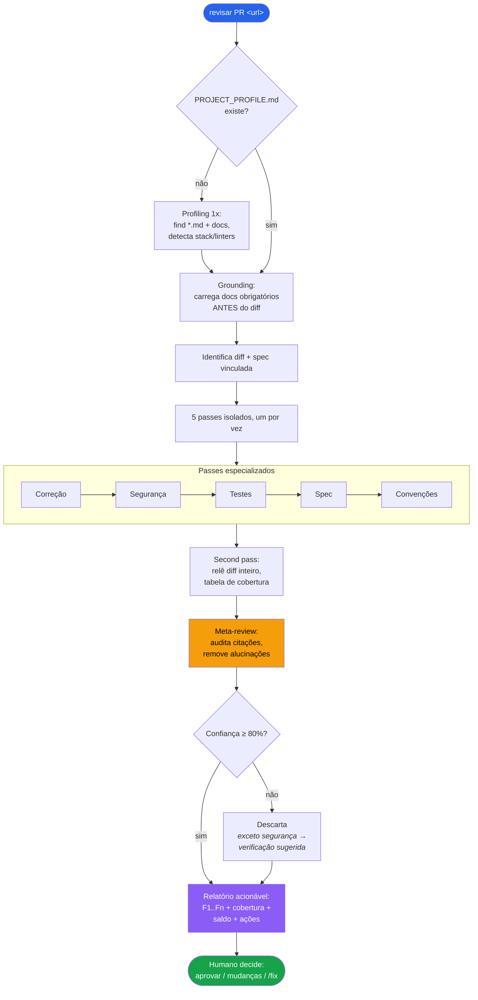
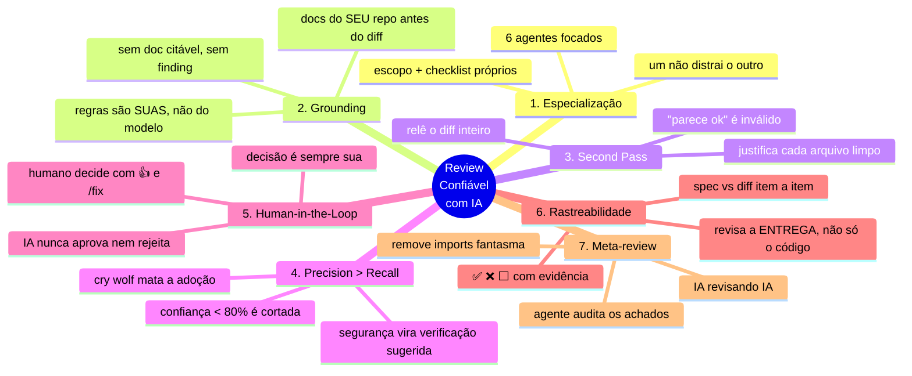

# pr-review-skill

Reviews de PR assistidos por IA **confiáveis o suficiente para agir sobre eles** — sem o ruído de falsos positivos que destrói a confiança na ferramenta.

Uma skill canônica versionada no seu repo. Funciona com **qualquer ferramenta agêntica** de código: a skill é markdown puro, agnóstico de ferramenta. Vem com adapters-ponteiro nativos para **Claude Code**, **Cursor** e **GitHub Copilot** — qualquer outro agente (Windsurf, Zed, Aider, Continue, …) é só apontar para `SKILL.md`. Baseada no framework *Os 7 Pilares do Review Confiável com IA*.

## Instalação

```bash
npx pr-review-skill init
```

Detecta as ferramentas presentes (`.claude/`, `.cursor/`, `.github/`), instala a skill canônica em `.claude/skills/pr-review/` (configurável com `--dir`) e gera adapters-ponteiro para cada ferramenta detectada. Idempotente — rodar duas vezes não sobrescreve nada sem `--force`. Use `--yes` em CI/scripts.

> **Qualquer agente.** Os adapters automáticos cobrem Claude Code, Cursor e Copilot. Para qualquer outra ferramenta agêntica, basta instruí-la a ler e seguir `.claude/skills/pr-review/SKILL.md` (ou o caminho que você definir com `--dir`) — o conteúdo da skill não depende de nenhuma ferramenta específica.

Depois commite a pasta instalada. O `git log` do diretório canônico vira o histórico das regras de review do seu time.

## Como usar

Com a skill instalada, peça um review passando a **URL do PR**:

```
revisar PR https://github.com/org/repo/pull/123
review this PR https://github.com/org/repo/pull/123
revisar este PR https://github.com/org/repo/pull/123
review the diff https://github.com/org/repo/pull/123
```

**No primeiro review do projeto**, a skill detecta automaticamente stack, linters e docs do seu repositório e gera um `PROJECT_PROFILE.md` — você só precisa responder o que ela não conseguir inferir sozinha. A partir do segundo review, o profile já está pronto e o review começa direto.

O resultado é sempre um **relatório acionável** com findings numerados (F1, F2 …), tabela de cobertura arquivo por arquivo, rastreabilidade contra o ticket/spec e saldo de auditoria. A IA nunca aprova nem rejeita — a decisão final é sempre sua.

## Comandos

| Comando | O que faz |
|---|---|
| `npx pr-review-skill init` | Instala skill canônica + adapters |
| `npx pr-review-skill@latest update` | Atualiza a skill; **nunca** toca no seu `PROJECT_PROFILE.md` nem nos adapters |
| `npx pr-review-skill doctor` | Diagnostica a instalação: o que existe, o que falta, próximo passo |

### Flags

| Flag | Descrição |
|---|---|
| `--dir <path>` | Diretório canônico da skill (default: `.claude/skills/pr-review`) |
| `--force` | Sobrescreve arquivos existentes no `init` |
| `--yes` | Pula confirmação interativa (útil em CI) |
| `--help`, `-h` | Mostra ajuda |

## Como funciona



O review segue um pipeline de 7 etapas, cada uma executada por um agente isolado:

### 1. Grounding (antes do diff)

Lê o `PROJECT_PROFILE.md` e carrega todos os docs marcados como `obrigatório` **antes** de olhar uma única linha do diff. Findings de convenção e arquitetura só podem citar esses docs — sem doc, sem finding.

### 2. Identificação do diff e spec

Obtém o diff completo do PR e procura o ticket ou spec vinculado (link no PR, ID na branch/título). Se houver spec, o passe de rastreabilidade roda; se não houver, é marcado como "não verificável".

### 3. Cinco passes especializados (um por vez)

Cada passe roda isolado, com escopo e checklist próprios:

| Passe | Foco |
|---|---|
| **Correção** | Bugs, lógica incorreta, erros de runtime |
| **Segurança** | OWASP, injeção, exposição de dados, autenticação |
| **Testes** | Cobertura, casos faltando, testes frágeis |
| **Spec** | Diff bate com os requisitos do ticket, item a item (✅/❌/⬜), scope creep |
| **Convenções** | Padrões do projeto conforme os docs; linters configurados não geram comentário |

Cada passe recebe: diff, stack detectada, lista de linters a suprimir e os docs obrigatórios. Um passe não contamina o outro.

### 4. Second pass — cobertura completa

Relê o diff inteiro e monta uma tabela com **todos** os arquivos alterados. Todo arquivo "limpo" precisa de justificativa específica — `"parece ok"` é inválido. Lockfiles e arquivos gerados são marcados explicitamente como "gerado — não revisado".

### 5. Meta-review (anti-alucinação)

Um agente audita os findings dos outros antes de entregar:

- Reconferência de toda citação `arquivo:linha` contra o diff real
- Remoção de imports fantasmas, assinaturas inventadas e dead code sem evidência
- Emite um saldo obrigatório: `"N auditados, M removidos (motivos), P rebaixados a pergunta"`

### 6. Filtro de confiança ≥ 80%

Findings com confiança abaixo de 80% são descartados. **Exceção deliberada:** findings de segurança com confiança < 80% não somem — viram "verificação sugerida" com a pergunta exata a responder. Falso negativo de segurança tem custo assimétrico.

### 7. Relatório

Montado a partir de um template estruturado com: findings com IDs estáveis + confiança + evidência + citação de doc; tabela de cobertura; rastreabilidade da spec; saldo de auditoria; e bloco de ações ao humano (aprovar / pedir mudanças / `/detalhar F1` / `/fix F1 F3`).

## Os 7 Pilares



1. **Especialização** — 6 agentes focados (5 passes + meta-review), cada um com escopo e checklist próprios
2. **Grounding** — os docs do SEU repo são carregados antes do diff; finding de convenção sem doc citável não é emitido
3. **Second Pass** — relê o diff inteiro e justifica, arquivo por arquivo, por que o que ficou limpo está limpo
4. **Precision > Recall** — findings com confiança < 80% são cortados; cry wolf mata a adoção
5. **Human-in-the-Loop** — a IA nunca aprova nem rejeita; o relatório termina oferecendo as ações a você
6. **Rastreabilidade** — diff verificado contra os critérios do ticket/spec, item a item (✅/❌/⬜), incluindo scope creep
7. **Meta-review** — um agente audita os achados dos outros antes de entregar: linhas inexistentes, APIs inventadas e regras sem fonte são removidas

## Estrutura instalada

```
.claude/skills/pr-review/        # skill canônica (fonte de verdade única)
├── SKILL.md                     # orquestração do review
├── passes/                      # 5 passes especializados + meta-review
│   ├── correcao.md
│   ├── seguranca.md
│   ├── testes.md
│   ├── spec.md
│   ├── convencoes.md
│   └── meta-review.md
├── checklists/                  # armadilhas por linguagem
│   ├── go.md
│   ├── java.md
│   ├── javascript.md
│   ├── kotlin.md
│   ├── python.md
│   └── ruby.md
├── templates/                   # relatório e PROJECT_PROFILE
│   ├── relatorio.template.md
│   └── PROJECT_PROFILE.template.md
├── profiling.md                 # parametrização automática do projeto
└── PROJECT_PROFILE.md           # gerado no 1º review — seu, nunca sobrescrito

.cursor/rules/pr-review.mdc                       # ponteiro → skill canônica
.github/instructions/pr-review.instructions.md    # ponteiro → skill canônica
```

O `PROJECT_PROFILE.md` registra stack, linters configurados e docs do projeto. O `update` **nunca** o sobrescreve — ele é seu.

## Linguagens suportadas

Go · Java · JavaScript/TypeScript · Kotlin · Python · Ruby

Cada linguagem tem um checklist próprio de armadilhas comuns carregado automaticamente a partir da stack detectada no `PROJECT_PROFILE.md`.

## Requisitos

- Node ≥ 18 (só para instalar/atualizar — o review roda na sua ferramenta de IA)

## Licença

MIT
